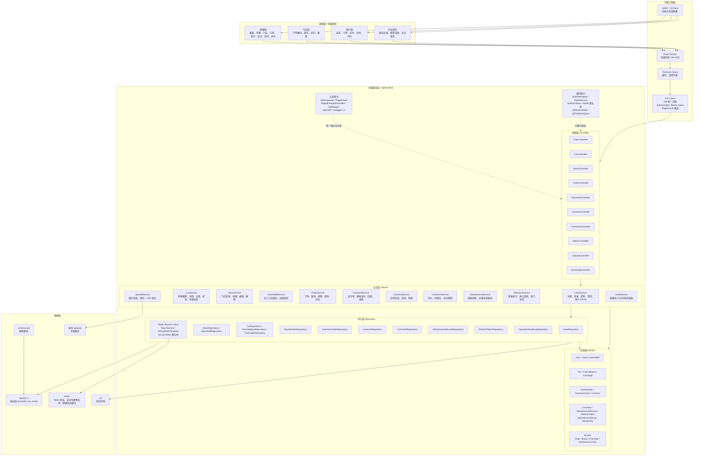
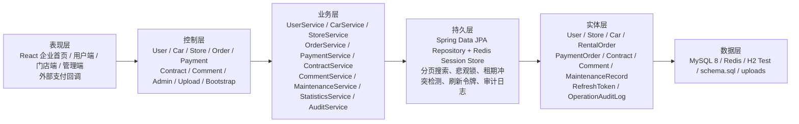
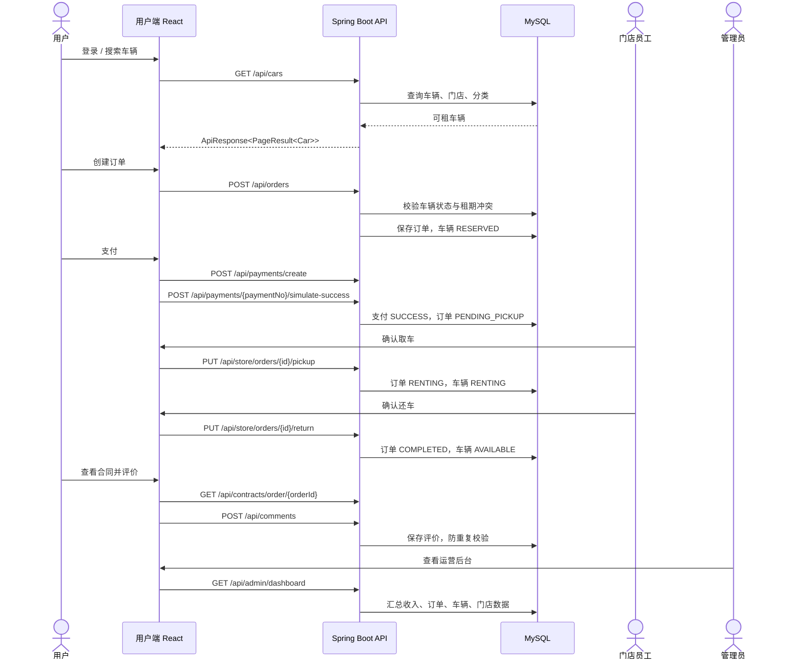

# DrivePilot 项目架构图

生成日期：2026-06-03

## 1. 全栈架构总览

## 2. 后端分层结构

## 3. 核心业务闭环

## 4. 关键接口模块

| 模块 | 主要接口 |
|---|---|
| 用户 | `POST /api/user/register`、`POST /api/user/login`、`GET/PUT /api/user/profile`、`POST /api/user/license` |
| 车辆 | `GET /api/cars`、`GET /api/cars/{id}`、`GET /api/cars/{id}/availability`、`/api/admin/cars/*` |
| 门店 | `GET /api/stores`、`GET /api/store/my-stores`、`/api/admin/stores/*` |
| 订单 | `POST /api/orders`、`GET /api/orders/my`、`PUT /api/orders/{id}/cancel`、`PUT /api/store/orders/{id}/pickup`、`PUT /api/store/orders/{id}/return` |
| 支付 | `POST /api/payments/create`、`POST /api/payments/{paymentNo}/simulate-success`、`POST /api/payments/callback`、`GET /api/admin/payments` |
| 合同 | `POST /api/contracts/generate`、`GET /api/contracts/order/{orderId}`、`PUT /api/contracts/{id}/sign`、`GET /api/admin/contracts` |
| 评价 | `POST /api/comments`、`GET /api/comments/car/{carId}`、`GET /api/admin/comments`、`DELETE /api/admin/comments/{id}` |
| 管理 | `GET /api/admin/dashboard`、`GET /api/admin/dashboard/revenue-trend`、`/api/admin/users/*` |
